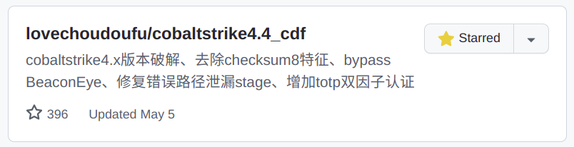

# about cobaltstrike4.4_cdf

[TOC]

如果您在寻找这个项目：

很抱歉他无了（被github关闭了）：

`Repository unavailable due to DMCA takedown.`

如果您对原文中的不涉及软件版权的去除checksum8特征、bypass BeaconEye、错误路径泄漏stage、totp双因子认证的思路和方法感兴趣，相信你可以在Internet中搜索到相关文章。
